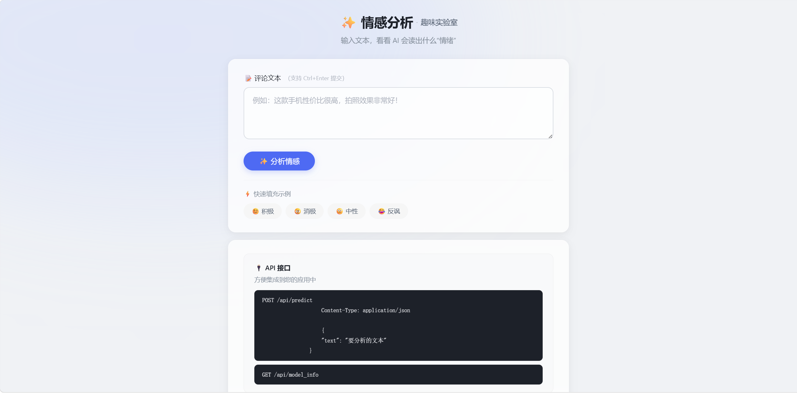
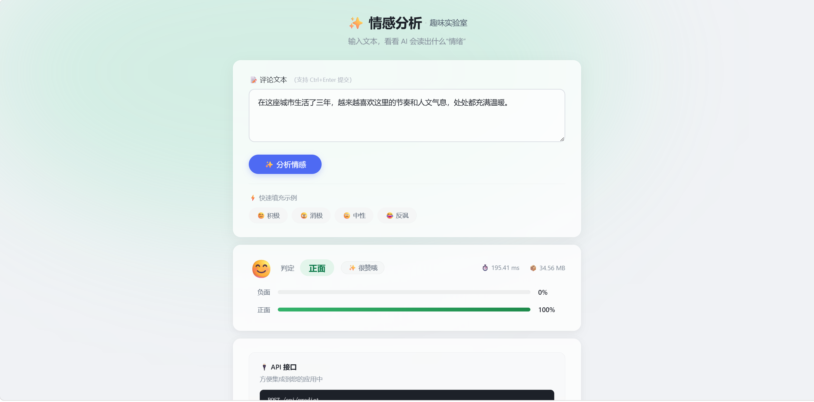
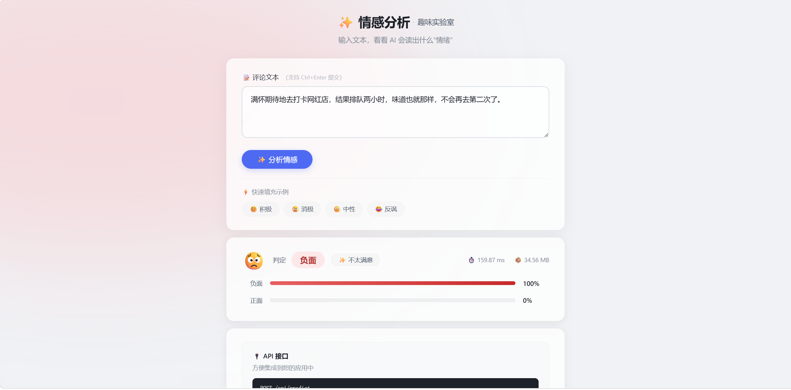

# 基于知识蒸馏的轻量级中文情感分析模型

> 深度学习课程设计 —— 将 BERT 的知识蒸馏到 BiLSTM，实现轻量级中文情感分类，并提供完整的部署方案

---

## 项目简介

本项目是《深度学习B》课程设计作品。针对 BERT 等预训练语言模型参数量大、推理速度慢、难以部署在资源受限设备（如移动端、嵌入式设备）的问题，采用**知识蒸馏（Knowledge Distillation）**技术，将微调后的 BERT-base-chinese（教师模型）的知识迁移至轻量级 BiLSTM（学生模型），在保持较高准确率的同时大幅降低模型体积和推理时间。

实验在 **ChnSentiCorp** 中文情感分类数据集（酒店、数码、书籍等多领域评论）上进行，蒸馏后的学生模型在测试集上达到了 **91.25%** 的准确率，相比纯监督基线（89.50%）提升了 **1.75 个百分点**，同时参数量仅为教师模型的 **8.86%**（约 9M vs 102M）。

项目最后将蒸馏模型封装为 Flask API 服务并提供了可视化的 Web 界面，形成"训练-评估-部署"的完整闭环。

---

## 项目结构

```
├── DL课程设计.ipynb          # 完整实验报告（含训练、评估、分析）
├── app.py                     # Flask API 服务（部署模块）
├── templates/
│   └── index.html             # Web 可视化界面
├── requirements.txt           # Python 依赖
├── README.md                  # 本文件
├── ChnSentiCorp/              # 情感分类数据集
├── models/
│   ├── bert-base-chinese-local/   # BERT 预训练权重
│   └── distilled_bilstm.pth       # 蒸馏训练后的 BiLSTM 权重
└── teacher_results/           # 教师模型微调结果
```

---

## 实验结果

| 模型 | 参数量 | 测试准确率 | 测试 F1 |
|:---|:---:|:---:|:---:|
| 教师 BERT（微调） | 102.27M | **94.58%** | **94.58%** |
| BiLSTM（纯监督基线） | 9.06M | 89.50% | 89.50% |
| BiLSTM（知识蒸馏） | 9.06M | **91.25%** | **91.25%** |

> 蒸馏后的学生模型保留了教师模型约 **96.5%** 的分类性能，参数量压缩至教师的 **8.86%**。

### 部署性能

| 指标 | 教师 BERT | 学生（蒸馏） | 提升 |
|:---|:---:|:---:|:---:|
| 推理时间（CPU） | 164.74 ms | 70.49 ms | 2.34x 加速 |
| 模型大小 | 413 MB | 36.5 MB | 压缩 91% |

---

## 快速开始

### 1. 环境配置

推荐使用 Python 3.9+，建议使用 conda 虚拟环境：

```bash
conda create -n kd_sentiment python=3.9
conda activate kd_sentiment
pip install -r requirements.txt
```

### 2. 下载必要资源

本项目需要以下预训练资源，请自行下载并放置到对应目录：

| 资源 | 来源 | 存放路径 |
|:---|:---|:---|
| BERT-base-chinese | Hugging Face | `models/bert-base-chinese-local/` |
| FastText 中文词向量 (300d) | FastText 官方 | `models/wiki.zh/wiki.zh.vec` |
| ChnSentiCorp 数据集 | Hugging Face | `ChnSentiCorp/` |

### 3. 训练与评估

启动 Jupyter Notebook，按顺序运行所有单元格：

```bash
jupyter notebook "DL课程设计.ipynb"
```

### 4. 启动部署服务

训练完成后，启动 Flask API 服务和 Web 界面：

```bash
python app.py
```

访问 `http://localhost:5000` 即可打开情感分析 Web 界面。

---

## 核心方法

### 教师模型
- **模型**：BERT-base-chinese（12 层 Transformer）
- **参数量**：102.27M
- **微调**：在 ChnSentiCorp 训练集上微调，测试准确率 94.58%

### 学生模型
- **模型**：2 层双向 LSTM（BiLSTM）
- **嵌入层**：300 维，使用 FastText 预训练词向量初始化
- **参数量**：9.06M

### 知识蒸馏
- **温度参数 T**：1.0
- **软标签权重 α**：0.3
- **损失函数**：`α * KL(soft_student || soft_teacher) * T² + (1-α) * CrossEntropy(student, hard_label)`
- **训练策略**：早停（patience=3）+ 学习率衰减

---

## API 接口

| 接口 | 方法 | 功能 |
|:---|:---:|:---|
| `/` | GET | 返回 Web 界面 |
| `/api/predict` | POST | 单条文本情感分析 |
| `/api/batch_predict` | POST | 批量文本情感分析 |
| `/api/model_info` | GET | 获取模型信息 |

### 调用示例

> 注：以下示例中的 `inference_time_ms` 为端到端耗时（含 Tokenization + 推理），与部署性能表格中的纯推理时间（70.49 ms）口径不同。

```json
// 响应
{
  "text": "这款手机性价比很高",
  "prediction": "正面",
  "confidence": {"负面": 0.0118, "正面": 0.9882},
  "inference_time_ms": 225.48
}
```

---

## Web 界面预览

部署服务启动后，访问 `http://localhost:5000` 即可体验完整的情感分析功能：

**首页**



**正面情感分析示例**



**负面情感分析示例**



---

## 结果分析

1. **蒸馏有效**：蒸馏后准确率（91.25%）比基线（89.50%）提升 1.75 个百分点，达到预期目标。
2. **压缩显著**：学生模型参数量（9.06M）仅为教师（102.27M）的 8.86%。
3. **部署可用**：封装为 API 后推理延迟约 100-225ms，Web 界面交互流畅。
4. **泛化良好**：从混淆矩阵可见，模型在正负类别上错误分布均衡，未出现严重偏向。
